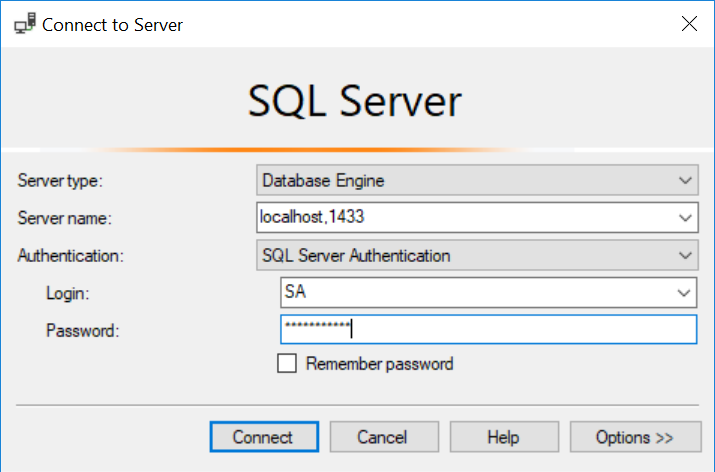
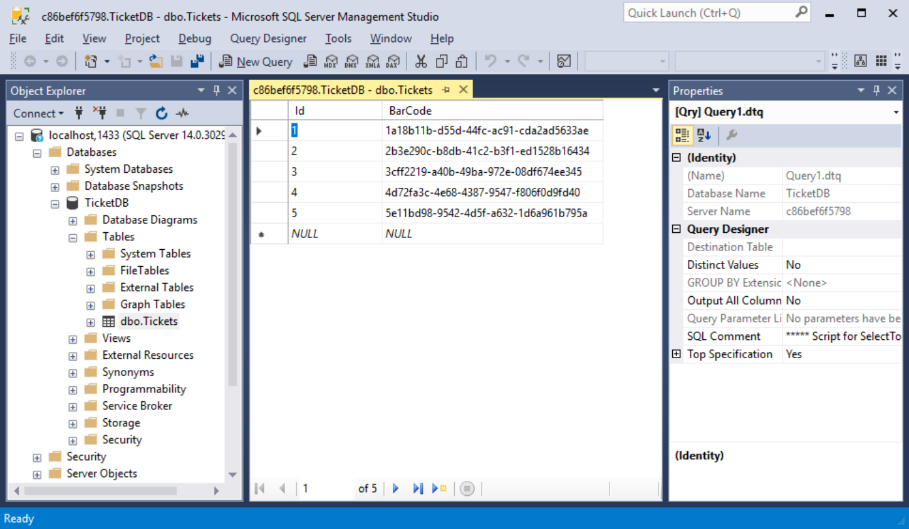

# Tutorial 3 - SQL Server container


#### Introduction

The use of containerized databases might seem limited at first, as you shouldn't be using them for production. However, the immutable nature of images, and isolated nature of containers, are interesting for demo and testing purposes. *Almost* gone are the days of *"Hey, it works on my machine"*.


#### Prerequisites

This tutorial assumes you have Windows 10 Pro and [.NET core](https://www.microsoft.com/net/learn/get-started/windows) installed. The professional edition is mandatory as we'll be using [Docker](https://www.docker.com/community-edition) for container deployment. Given the .NET core framework evolves quickly, it's worth noting these tutorials are written and tested against .NET core 2.1 (your results may vary).

In previous tutorials we first ran a ticketservice container, built from our custom Docker image and then used docker-compose to compose and scale our app. In this tutorial we will continue developing our ticketservice, building upon our existing codebase. Feel free to grab it from [GitHub](https://github.com/mindems/Docker.NET/tree/master/Tutorial2) if you want to tag along.


#### The Data Store

In this tutorial we swap the random generator, used to supply ticket barcodes, with a seeded data store.

The challenge here is mainly a timing issue. SQL Server takes some time to start up and meanwhile you (obviously) can't interact with any databases. In this case, we want to seed our database with demo data. We'll be using a simple *.sql* script to do just that and won't bother mapping our model or using attributes. As complexity of your app grows, you might want to consider other options. However, for the purpose of this tutorial, I want to focus on the Docker setup an how the needed files interact.

The basic workflow:

- Use a *Dockerfile* to create a custom SQL data image
- Point the entrypoint to a bash script containing `sqlcmd` commands
- Create and seed the database with an *.sql* script

Let's reorganize our solution to keep the contexts separated. Create a root directory *Ticket* and move the *TicketService* project folder into it. Next, create a new folder named *TicketData* inside the *Ticket* root directory. In this folder we'll have **3 files**, needed to build our database image.

Up first, the **Dockerfile**.

```
FROM microsoft/mssql-server-linux

# Install netcat and clean up APT when done
RUN apt-get update && apt-get install -y netcat \
 && apt-get clean && rm -rf /var/lib/apt/lists/*

WORKDIR /usr/src/app
COPY . ./

ENTRYPOINT [ "/bin/bash", "./entrypoint.sh" ]
CMD [ "/opt/mssql/bin/sqlservr" ]
```

After pulling the Microsoft image from the Docker registry, we install *netcat* from Ubuntu's APT repository. We will use this utility to find out when the server is properly initialized.

The other thing worth pointing out is how the last two lines play together. `ENTRYPOINT` executes the bash script (explained next). While `CMD` passes a parameter to the script, which will be executed at the end of it. The script *needs* to use UNIX line delimiters. It won’t work if you use Windows-based delimiters (Carriage return and line feed). You can use [Notepad++](https://notepad-plus-plus.org/), for example, to set line endings. You'll find the setting when you go to menu *Edit* > *EOL Conversion* > *Linux*. 

Next, save the file **entrypoint.sh** with the contents below.

```
#!/bin/bash

set -e

if [ "$1" = '/opt/mssql/bin/sqlservr' ]; then
  # Initialize the database on first run
  if [ ! -f /tmp/app-initialized ]; then
    function initialize_app_database() {
    # Wait for SQL Server to start
    printf "Connecting to SQL Server"
    until $(nc -z localhost 1433); do
      printf '.'
      sleep 2
    done      
      # Create and seed the database
      /opt/mssql-tools/bin/sqlcmd -S localhost -U sa -P "<!Passw0rd>" \
        -i /usr/src/app/ticketDb.sql
      # Note the container has been initialized
      touch /tmp/app-initialized
    }
    # Call the function asynchronously
    initialize_app_database &
  fi
fi

exec "$@"
```

To find out if our server is up and running, the following netcat command is used repeatedly: 

 `nc -z localhost 1433`

Once the server is initialized, the loop exits and we execute our first command on the server. This is where and when the password is set. 

The function is executed in the background (called asynchronously by adding the `&` at the end of the line), which allows the `nc` checks to happen at the same time the server is being initialized. This initialization is requested with `exec "$@"`, executing the `CMD` parameter from the Dockerfile.

Finally, the **ticketDb.sql** file

```
CREATE DATABASE TicketDB
GO

USE TicketDB
CREATE TABLE Tickets (Id INT, BarCode NVARCHAR(50))
GO

INSERT INTO Tickets VALUES (1, '1a18b11b-d55d-44fc-ac91-cda2ad5633ae'); 
INSERT INTO Tickets VALUES (2, '2b3e290c-b8db-41c2-b3f1-ed1528b16434');
INSERT INTO Tickets VALUES (3, '3cff2219-a40b-49ba-972e-08df674ee345'); 
INSERT INTO Tickets VALUES (4, '4d72fa3c-4e68-4387-9547-f806f0d9fd40');
INSERT INTO Tickets VALUES (5, '5e11bd98-9542-4d5f-a632-1d6a961b795a'); 
GO
```

Time for a test drive, in PowerShell, navigate to the *TicketData* folder and execute the following commands.

To build the image.

`docker build -t ticketdata-image .`

To run a container (remember to use the same password as in the *entrypoint.sh* script). 

`docker run -e 'ACCEPT_EULA=Y' -e 'SA_PASSWORD=<!Passw0rd>' -p 1433:1433 --name=ticketdata ticketdata-image`

Given we're testing, I chose not to use the `-d` option (detached mode) and allow all the output to be printed to the current PowerShell window, just remember to leave it open for as long as you're testing.

After an initial delay a connection is made and the database is seeded, among the final output you'll notice:

```
Changed database context to 'TicketDB'.
(1 rows affected)
(1 rows affected)
(1 rows affected)
(1 rows affected)
(1 rows affected)
```

Finally, a blinking cursor, indicating the *ready* or *waiting* state of the SQL server.

*Optional:* it's easy to check if all went well if you have MSSM (Microsoft SQL Server Management Studio 17) installed. At the login window, choose SQL Server authentication and use the settings below.




Our host is listening on `localhost`, we've set the port to `1433` when we launched the container:

```
docker run -e 'ACCEPT_EULA=Y' -e 'SA_PASSWORD=<!Passw0rd>' -p 1433:1433 --name=ticketdata ticketdata-image
```

The password is set on first use, which was in the *entrypoint.sh* script. To be sure, I'm referring to the line:

```
/opt/mssql-tools/bin/sqlcmd -S localhost -U sa -P "<!Passw0rd>" -i /usr/src/app/ticketDb.sql
```

Once connected, we can view our data and verify the *.sql* file is executed correctly.



*To open up the table in the middle, right-click* `dbo.Tickets` (in the left pane) *and select* `Edit top 200 rows`. 


#### Tickets please

As mentioned before, we'll only be making minimal changes to our codebase. The purpose of this tutorial isn't to implement *migrations*, use generated restore scripts, or even apply attributes. Using EF conventions, let's end this series in the same way we began... In the spirit of less is more.

Add *TicketContext.cs* to the *TicketService* project folder.

```
using Microsoft.EntityFrameworkCore;

namespace TicketService
{
    public class TicketContext : DbContext
    {
        public TicketContext(DbContextOptions<TicketContext> options) : base(options)
        {
        }
        public DbSet<Ticket> Tickets { get; set; }
    }
}
```

In *Startup.cs* add a `using` directive:

```
using Microsoft.EntityFrameworkCore;
```

And replace the `Startup` class with:

    public class Startup
    {
        // This method gets called by the runtime. Use it to add services to the container.
        public void ConfigureServices(IServiceCollection services)
        {
            // Add TicketContext to the IoC container.
            string connection = @"Server=sql.data;Database=TicketDB;User=sa;Password=<!Passw0rd>;";
            services.AddDbContext<TicketContext>(options => options.UseSqlServer(connection));
        }
    
        // This method gets called by the runtime. Use it to configure the HTTP request pipeline.
        public void Configure(IApplicationBuilder app, IHostingEnvironment env)
        {
            if (env.IsDevelopment())
            {
                app.UseDeveloperExceptionPage();
            }
    
            app.Run(async (context) =>
            {
                // Extract id from request
                string idString = context.Request.Query["id"].FirstOrDefault();
                int id = int.TryParse(idString, out int result) ? result : -1;
                // Build the response
                string barcode = app.ApplicationServices.GetService<TicketContext>()
                                    .Tickets.Find(id).BarCode;
                string hostname = System.Net.Dns.GetHostName();
                string html = "<h3>Hi Visitor!</h3>" +
                $"Here is your ticket: <b>{barcode}</b><br/>" +
                $"Brought to you by: <b>{hostname}</b><br/>";
                await context.Response.WriteAsync(html);
            });
        }
    }
In the code above, we're not placing any bounds on the range of `id`. I'll leave validation for the reader to implement, for example returning *"Sold out"* if `id` exceeds the number of tickets in the database.

Next, move *docker-compose.yml* from the *TicketService* project folder to the *Ticket* root directory and edit the contents.

```
version: "3"
services:
  ticket:
    image: ticketservice-image
    build: ./TicketService/
    ports:
      - "4000:80"
    depends_on:
      - sql.data
  sql.data:
    image: ticketdata-image
    build: ./TicketData/
    environment:
      SA_PASSWORD: "<!Passw0rd>"
      ACCEPT_EULA: "Y"
```

Or, we could've skipped all the previous steps and pull the images from registry instead:

```
version: "3"
services:
  ticket:
    image: mindems/docker:tutorial3-service
    ports:
      - "4000:80"
    depends_on:
      - sql.data
  sql.data:
    image: mindems/docker:tutorial3-data
    environment:
      SA_PASSWORD: "<!Passw0rd>"
      ACCEPT_EULA: "Y"
```

Fire up PowerShell, navigate to the *Ticket* root folder and run the following commands,

- **For local builds/images**, rebuild `ticketservice-image` from our updated codebase:

  ```
  docker-compose build
  ```

- Run the app:

  ```
  docker-compose up
  ```


Once the database is seeded, you should be able to visit our ticketservice at `http://localhost:4000/?id=1`, for `id`s 1 to 5.


#### Conclusion

In this final part of the series, we bootstrapped our app with a SQL server container. We did so by executing a bash script to overcome timing issues and a Transact-SQL script to seed the database.

This concludes our intro to Docker, for a thorough exploration of the Microsoft stack feel free to visit:

https://docs.microsoft.com/en-us/dotnet/standard/microservices-architecture/


#### Resources

- https://docs.microsoft.com/en-us/sql/linux/quickstart-install-connect-docker?view=sql-server-linux-2017
- https://github.com/Microsoft/mssql-docker/issues/229
